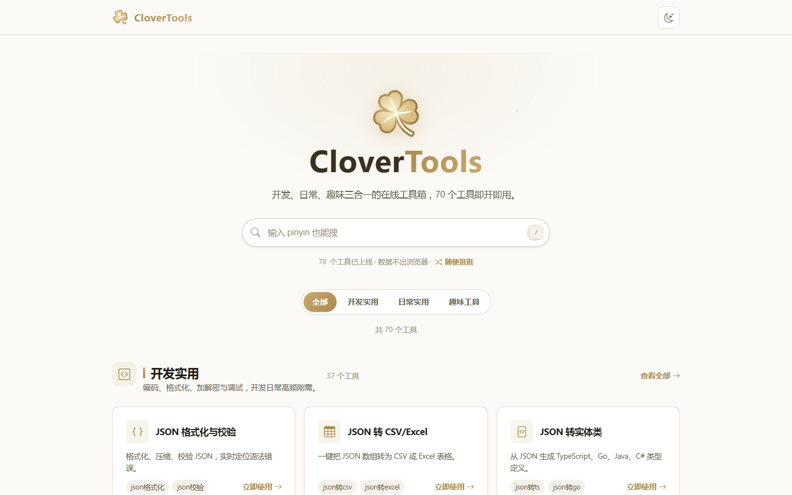

<p align="center">
  
</p>

<h1 align="center">CloverTools</h1>

<p align="center">
  精选在线工具箱 · 70 个手写工具 · 即开即用 · 无需注册
</p>

<p align="center">
  <a href="https://clovertools.cn"><strong>在线访问 clovertools.cn</strong></a> ·
  <a href="https://github.com/YupenBob/clover-tools"><strong>GitHub 仓库</strong></a>
</p>

<p align="center">
  <a href="https://clovertools.cn"></a>
  <a href="https://github.com/YupenBob/clover-tools"></a>
  <a href="https://github.com/YupenBob/clover-tools"></a>
  <a href="https://astro.build"></a>
  <a href="https://pages.cloudflare.com"></a>
  <a href="https://clovertools.cn"></a>
</p>

CloverTools 是一个精品在线工具箱，覆盖「开发实用 / 日常实用 / 趣味工具」三大类共 70 个逐一手写的工具页面。所有工具纯浏览器处理、数据不出本地，打开即用，无需下载、无需注册。

## 数据面板

| 指标 | 数值 |
| --- | --- |
| 工具总数 | 70（开发实用 37 · 日常实用 20 · 趣味工具 13） |
| 工具 API | 1 个 Pages Function |
| 内容生态 | 137 篇 CSDN SEO 文章 + 品牌文 + 发布排期 |
| 数据处理 | 100% 浏览器端，数据不出本地 |
| 使用门槛 | 零注册、零安装、即开即用 |

## 特性

- **即开即用**：无需注册、无需安装，打开页面直接使用
- **隐私优先**：全部纯浏览器处理，数据不出本地
- **精品手写**：每个工具页逐一手写，内置输入校验、错误提示、复制 / 清空 / 示例与 Ctrl+Enter 快捷执行，拒绝模板化
- **三分类目录**：开发实用 / 日常实用 / 趣味工具，首页搜索直达
- **设计与体验**：金色主题 + 深色模式、移动端适配、全站图标统一 iconfont（禁止 emoji 字符）
- **工程化完备**：Astro 5 静态构建、SEO meta + JSON-LD + sitemap 自动生成、构建后自动质检（链接完整性 / SEO 结构 / emoji 扫描）
- **全球加速**：Cloudflare Pages + CDN 托管，R2 存储大文件 / 媒体，Pages Functions 提供工具 API

## 技术架构


## 界面预览



## 多语言与国际化（i18n）

- 中文（默认，根路径）与 English（`/en/` 前缀）双语全站支持
- 页头语言切换器按当前路径保持页面位置（404 页切换时回到对应语言首页）
- 全站输出 `hreflang`（`zh-CN` / `en` / `x-default`）、语言专属 canonical 与 `og:locale`
- 英文文案集中在 `src/lib/i18n/en.json`：站点文案、分类、70 个工具的名称/描述/关键词与「使用说明」
- 双语言搜索索引：`public/search-index.json`（中文 + 拼音）与 `public/en/search-index.json`（英文）
- 英文工具页由 `scripts/i18n-translate.mjs`（DeepSeek API 批量翻译）与 `scripts/fix-big-pages.mjs`（超长页分段翻译）生成；新增工具后补充 `en.json` 英文元信息并重新构建即可

## 项目结构

```
src/
  pages/index.astro                  # 首页：三分类目录 + 搜索
  pages/en/                          # 英文版（/en/ 路由）：首页、关于、404、分类页与全部工具页
  pages/tools/{cat}/{slug}.astro     # 工具页（cat: dev | daily | fun）
  pages/tools/[category]/index.astro # 分类页（动态路由）
  pages/404.astro                    # 404 页
  layouts/                           # BaseLayout / ToolLayout
  components/                        # 页头、页脚、工具卡片
  lib/tools.ts                       # 工具清单：驱动首页、sitemap、重定向
  lib/i18n.ts                        # 多语言助手：语言推断、路径换算、文案字典
  lib/i18n/en.json                   # 英文数据字典（站点 / 分类 / 工具元信息 / 使用说明）
  styles/global.css                  # 设计系统：金色主题 + 深色模式
functions/api/                       # Pages Functions（工具 API，如 ip.ts）
public/
  _headers  _redirects  robots.txt   # Pages 配置
  clover-logo.svg  og-image.jpg      # 品牌资产
legacy/                              # 旧版 CloverTools 代码归档（仅参考）
scripts/                             # 质检与生成脚本（链接、SEO、emoji、sitemap、CSDN）
data/                                # 内容数据（articles.json / keywords.json）
csdn/                                # CSDN 发布包（137 篇文章 + 品牌文 + 排期表）
```

## 快速开始

```bash
git clone git@github.com:YupenBob/clover-tools.git
cd clover-tools
npm install

npm run dev        # 本地开发 http://localhost:4321
npm run build      # 构建到 dist/
npm run preview    # 本地预览构建产物
npm run check      # 构建后质检：链接完整性 + SEO 结构 + emoji 扫描
```

## 分类导览

| 分类 | 定位 | 代表工具 |
| --- | --- | --- |
| 开发实用（37） | 编码、格式化、加解密与调试，开发日常高频刚需 | JSON 格式化与校验、JSON/XML/YAML 互转、正则测试、Base64、哈希与加解密、JWT 解码、二维码、HTTP 测试、IP 查询 |
| 日常实用（20） | 日期、理财、换算与效率小工具，生活工作两相宜 | 在线万年历、公历农历互转、世界时钟、时间戳转换、年龄计算、单位换算、人民币大写、键盘测试 |
| 趣味工具（13） | 减压、娱乐与创意小玩意，给忙碌的日常加点乐趣 | ASCII 艺术字、点击速度测试、反应力测试、舒尔特训练、目标球追踪、抽奖、摩斯密码 |

## 添加工具（精品制作规范）

1. 在 `src/lib/tools.ts` 的对应分类数组里登记工具元信息（slug、名称、一句话描述、iconfont 图标类、关键词、tier）
2. 手写页面 `src/pages/tools/{cat}/{slug}.astro`，使用 `ToolLayout`
3. 页面必须包含：输入校验与错误提示、复制 / 清空 / 示例、Ctrl+Enter 快捷执行、移动端适配、SEO meta（布局已内置 JSON-LD）
4. 图标一律 `bi bi-*` iconfont 类名，禁止 emoji 字符
5. 需要服务端能力的工具，在 `functions/api/` 增加 Pages Function，前端 `fetch('/api/...')`
6. 若保留旧版同名工具，在 `public/_redirects` 中补充旧路径 301 到新路径
7. 提交前运行 `npm run check` 全部通过

## 部署与运维

### Cloudflare Pages

连接本 GitHub 仓库创建 Pages 项目，构建命令 `npm run build`，输出目录 `dist`；push 到 `main` 分支自动构建部署，并绑定自定义域名 `clovertools.cn`。

### Cloudflare R2（媒体存储）

```bash
wrangler r2 bucket create clovertools-media
wrangler r2 object put clovertools-media/<key> --file <path>
```

在 Pages 项目设置中绑定同名 R2 桶（变量名 `CLOVER_MEDIA`），Functions 通过 `context.env.CLOVER_MEDIA` 访问。

### Web Analytics（可选）

创建 Cloudflare Web Analytics 后，将站点级发布 token 写入环境变量 `PUBLIC_CF_BEACON_TOKEN`，构建后自动注入 beacon 脚本。

### 搜索收录与监控

1. **Google Search Console / Bing Webmaster**：DNS TXT 验证 `clovertools.cn`，提交 `https://clovertools.cn/sitemap-index.xml`
2. **主动推送**：部署完成后运行 `npm run indexnow` 推送全站 URL（key 文件 `public/<32位hex>.txt` 已随仓库生成，勿删除）
3. **百度站长平台**：文件验证后把 `baidu_verify_*.html` 放入 `public/` 并重新部署（参考 `public/baidu-verify.example.html`）
4. **数据闭环**：以 GSC「曝光 → 点击」排序工具页，Top 20 无收录页逐批排查，每周关注覆盖率与抓取统计

## 内容生态（CSDN）

SEO 文章已从站内剥离，独立发布在 CSDN；运行 `npm run csdn:build` 生成发布包到 `csdn/`（137 篇 SEO 文章 + 品牌文 + 发布排期表，详见 `csdn/README.md`）。

## 约定

- 全中文站点，无营销文案、无注册引导
- 旧版 Vercel 相关代码已整体归档在 `legacy/`，仅作参考
